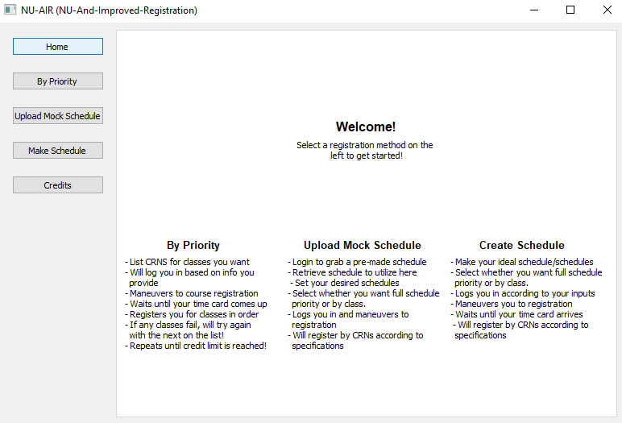
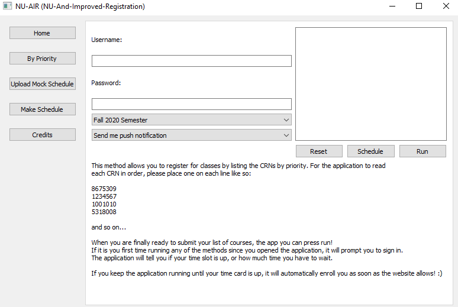

# NU-AIR.py
The NU And Improved Registration application for Northeastern University. 

### Story Time:
This application is designed to fix a major flaw in my University's course registration system. Registering for classes is one of
the biggest (previously) unavoidable problems in the lives of college kids everywhere. The combination of too few 
classes being offered, too few seats in those classes, and strict course requirements turns registration by time-slot into a 
stress-filled, all-out sprint. Since the administration has other priorities, we have created our OWN 
solution: NU-AIR.

### The Solution:
NU-AIR automatically enrolls you in the most optimal set of classes (specified by the user in various formats) and when your time card comes up it will instantly register you for these classes. Essentially, if there was ever a possibility of you getting those classes you really need, NU-AIR would get them for you.

### How to Use:
- Clone this locally:
    - Open GitBash
    - Type "cd Desktop"
    - Type "git clone git@github.com:allenwest24/NU-AIR.git"
- Open the folder in Atom or some other Python text editor that can use PyQt5 and Selenium
- Build/run

- Choose your method of registration on the left.

- Press run.
- Sit back and watch the program do its thing!

### Current State:
- Completely automated registration.
- Design features not yet implemented.
- Checking for unopened or unavailable semsesters not yet available.
- Currently working on the scheduling feature.
- Check issues for more details.

### How to contribute:
- Create a branch and put in some work.
    OR
- Email me @ west.all@husky.neu.edu to collab.

### Resources:
- https://github.com/mherrmann/fbs-tutorial for creating the venv and generating the proper file structure/code to start the app.
- https://github.com/meieri/Agilecraft-Automation-Application/blob/master/src/main/python/main.py for initial setup of subclass 
  structure.
- https://www.luochang.ink/ for sidebar help.
- https://build-system.fman.io/pyqt5-tutorial for useful documentation
- https://www.bogotobogo.com/Qt/Qt5_GridLayout.php for formatting with PyQt5
- https://www.youtube.com/watch?v=dz59GsdvUF8 for help with chromedriver setup
- https://pythonspot.com/selenium-click-button/ for naviagting around with chromedriver
- https://sites.google.com/a/chromium.org/chromedriver/downloads to update the monthly version of the chromedriver
- https://doc.qt.io/qt-5/qmessagebox.html for help with PyQt5's QMessageBox 
